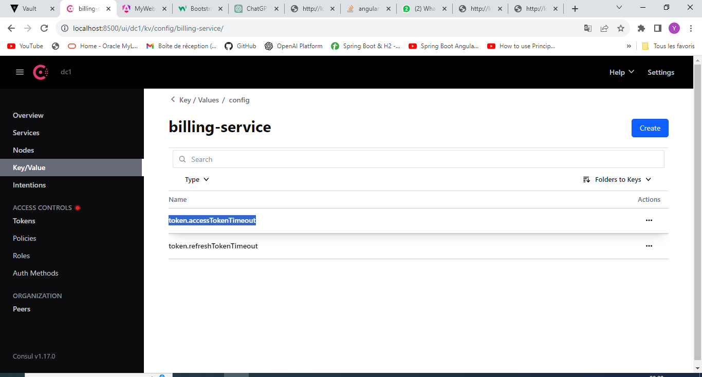

<h1>E-commerce Application basé sur les Micros-services</h1>
  

Créer une application de e-commerce basée sur les micro services :
1. Consul Discovery
2. Spring Cloud Config
3. Spring Cloud Gateway
4. Customer-service
5. Inventory Service
6. Order Service
7. Consul Config (Billing Service)
8. Vault (Billing Service)
9. Frontend Web avec Angular 

<h3>La page Consul server :</h3>

<h3>La page Vault server:</h3>

  
<h3>Customer Params Test:</h3>

  
<h5>La liste des Customers:</h5>

  
<h3>Liste des Orders:</h3>

         
<h1>Partie Front-end</h1>
  
<h3>List Products</h3>

  
<h3>List Orders by Cutomer</h3>

<h3>List Orders-Details by Cutomer</h3>

